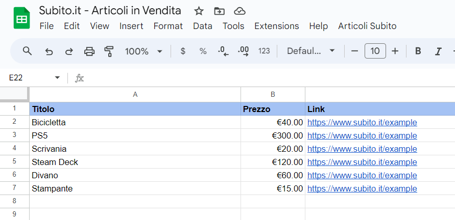

# Subito-it-articoli-venditore
Script per estrarre tutti gli articoli in vendita di un profilo su Subito.it e stamparli su un foglio di Google Sheet.

Aprendo la pagina di un profilo su Subito.it, non è possibile vedere tutti gli annunci pubblicati dall'utente ma solo alcuni dei più recenti. Con questo script di Google Apps Script è possibile estrarre invece tutti i singoli articoli in vendita di un utente e stampare il titolo, il prezzo e il link di ogni articolo su un foglio Google Sheet.

Link Google Sheet con script:

https://docs.google.com/spreadsheets/d/1ylRpW6b529Rfci8eQx539AdI4a5un9Romy8-K5eqMY4/copy

## Utilizzo

Dopo aver creato una copia del foglio, per far partire lo script basta andare sulla toolbar in alto e cliccare sull'opzione "Articoli Subito" > "Leggi Articoli in Vendita". La prima volta che si lancia lo script sarà necessario concedere le autorizzazzioni. 

